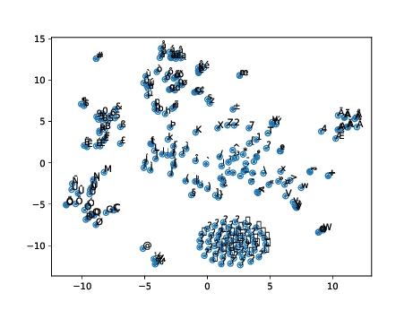

# Text Processing Like Humans Do: Visually Attacking and Shielding NLP Systems

This repository contains selected code and data for our NAACL 2019 long paper on [Visually Attacking and Shielding NLP Systems](https://arxiv.org/pdf/1903.11508v1.pdf).

## Citation

```
@inproceedings{Eger:2019:NAACL,
            title = {Text Processing Like Humans Do: Visually Attacking and Shielding NLP Systems},
            year = {2019},
          author = {Steffen Eger and G{\"o}zde G{\"u}l {\c S}ahin and Andreas R{\"u}ckl{\'e} and Ji-Ung Lee and Claudia Schulz and Mohsen Mesgar and Krishnkant Swarnkar and Edwin Simpson and Iryna Gurevych},
       booktitle = {Proceedings of the 2019 Conference of the North American Chapter of the Association for Computational Linguistics},
           month = {Februar},
         journal = {NAACL 2019},
             url = {http://tubiblio.ulb.tu-darmstadt.de/111643/}
}
```
> **Abstract:** Visual modifications to text are often used to obfuscate offensive comments in social media (e.g., ''!d10t'') or as a writing style (''1337'' in ''leet speak''), among other scenarios.
We consider this as a new type of adversarial attack in NLP,  a 
setting
to which humans are very robust, 
as our experiments with both simple and more difficult visual perturbations demonstrate.
We 
investigate 
the impact of visual adversarial attacks
on current NLP systems on character-, word-, and sentence-level tasks, 
showing 
that both neural and non-neural models are, in contrast to humans, 
extremely sensitive to such attacks, 
suffering performance decreases of up to 82\%. 
We then explore three shielding methods---visual character embeddings, adversarial training, and rule-based recovery---which
substantially improve the robustness of the models.
However, the shielding methods still fall behind performances achieved in 
non-attack scenarios, which demonstrates the difficulty of dealing with visual attacks.


Contact persons: Steffen Eger, eger@ukp.informatik.tu-darmstadt.de, Gözde Gül Sahin (sahin@ukp...), Andreas Rückle (rueckle@ukp...), Ji-Ung Lee (lee@ukp...), ...

https://www.ukp.tu-darmstadt.de/

https://www.tu-darmstadt.de/


Don't hesitate to send us an e-mail or report an issue, if something is broken (and it shouldn't be) or if you have further questions. 

## Project Description

### Embeddings

We created diverse embeddings, including 576 dimensional visual Character Embeddings (called `vce.normalized` in the folder below).

All embeddings and weights can be found on our public file server:

https://public.ukp.informatik.tu-darmstadt.de/naacl2019-like-humans-visual-attacks/

A tsne visualization of the visual character representations from `vce.normalized` (restricted to the first 250 chars) is given below.

<!--  -->


### VIPER

VIPER is our visual text perturber. More information on VIPER can be found in `code/VIPER`

### G2P model

See `code/G2P`

### Toxic comments training and testing

See `code/TC`

### POS Tagging and Chunking

See `code/POS_Chunk`

### Semantic Similarity Sanity Check

In the appendix, we performed a semantic similarity "sanity check" to check whether VELMo assigns higher cosine similarity to a pair of (clean,perturbed) sentences than SELMo. The pairs are of the form: 

```Greetings Hey douche bag wassup```
```Grëȩtinɋs Ηey ḏoʋchḛ bag ✿ąssɥp```

The code can be found in `code/sanity_check`

### AllenNLP modifications

To run the visually informed models, we did some modifications on the AllenNLP code. The modified versions can be found in `code/AllenNLP_Modifications` and are necessary to obtain the respective embedding representations for _toxic comment classification_, _chunking_, and _POS tagging_.
